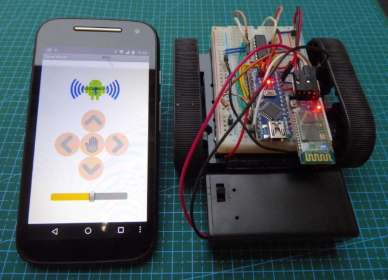

# Zumo_Rover
#### Een robotvoertuig met een Zumo chassis bestuurd met een Arduino Nano en Bluetooth via een android app gemaakt met MIT App Inventor

De documentatie beschrijft :
1. de gebruikte hardware en het schema met de verbindingen tussen de verschillende onderdelen
2. de Android app gemaakt met MIT App Inventor voor de besturing via Bluetooth
3. de Arduino code die de Bluetooth commando's ontvangt en uitvoert
